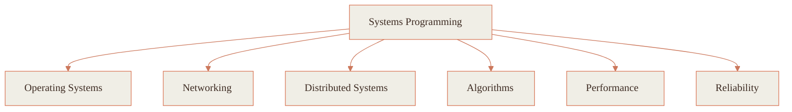

  

 

👋 &nbsp; Hi, I'm <b>Meredithelin</b> — a CS student at <b>HIT (Shenzhen)</b>.

I like building things that are clear, careful, and a little curious — 
usually low in the stack, in <b>Rust</b>, <b>Go</b>, or <b>C++</b>, asking <i>why</i> a system behaves the way it does.

I'd rather understand something deeply than just get it working. 
Good code is mostly good thinking made legible — and I'm still learning what that means.

 

<h3 align="center">🧰 &nbsp; Tech I work with</h3>

  

  

  

 

<h3 align="center">📈 &nbsp; Activity</h3>

<picture>
  <source media="(prefers-color-scheme: dark)" srcset="https://raw.githubusercontent.com/Meredithelin/Meredithelin/output/github-contribution-grid-snake-dark.svg">
  <source media="(prefers-color-scheme: light)" srcset="https://raw.githubusercontent.com/Meredithelin/Meredithelin/output/github-contribution-grid-snake.svg">
  
</picture>

  

&nbsp;

  

  

 

<h3 align="center">🧭 &nbsp; How I think about systems</h3>

 

<h3 align="center">📫 &nbsp; Find me</h3>

&nbsp;&nbsp;

&nbsp;&nbsp;

&nbsp;&nbsp;

 

<i>Thanks for reading this far. Be well, and build something kind.</i> 🧡

  

