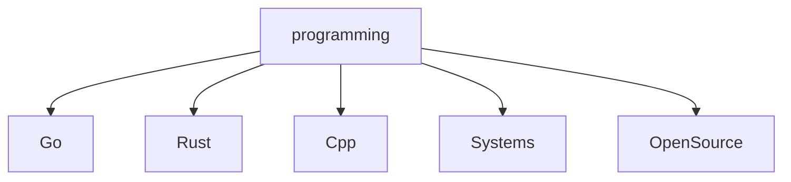

<!--   my-icons -->

  
  
  
  

<!--   my-header-img -->

<!--   my-ticker -->
[;Always+learning+new+things)](https://git.io/typing-svg)

<!--   my-skils -->
| Property | Data |
|---|---|
| **Language / IDE** |       |
| **Domain Knownledge** |     |
| **CI / CD** |     |
| **Databases** |   |

### 📈 GitHub Activity Graph:

| . | . |
|---|---|
|  |  |

</img>

</img>
</img>

**📫 How to Reach me:**

Trophy: Github Profile Trophy

