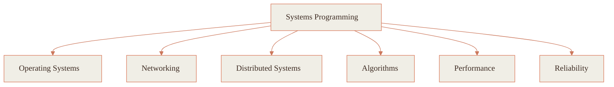

<!--   badges -->

  
  
  
  
  

<!--   intro -->
### 👋 Hi, I'm Meredithelin 

I'm a CS student at **HIT (Shenzhen)**. I like building things that are clear, careful, and a little curious — usually somewhere low in the stack, in Rust, Go, or C++, asking *why* a system behaves the way it does.

I'd rather understand something deeply than just get it working. Good code is mostly good thinking made legible, and I'm still learning what that means. Glad you stopped by.

<!--   typing banner -->

---

### 🧰 What I work with

| Property | Data |
|---|---|
| **语言 · Languages** |      |
| **IDEs / Tools** |   |
| **Domain Knowledge** |     |
| **CI / CD** |    |
| **Databases** |   |
| **Coding Platforms** |   |

---

### 📈 Activity

<picture>
  <source media="(prefers-color-scheme: dark)" srcset="https://raw.githubusercontent.com/Meredithelin/Meredithelin/output/github-contribution-grid-snake-dark.svg">
  <source media="(prefers-color-scheme: light)" srcset="https://raw.githubusercontent.com/Meredithelin/Meredithelin/output/github-contribution-grid-snake.svg">
  
</picture>

| GitHub Stats | 主要编程语言 · Top Languages |
|---|---|
|  |  |

---

### 🧭 How I think about systems

---

### 📫 Find me

  
  
  
  &nbsp;
  
  

---

<i>Thanks for reading this far. Be well, and build something kind.</i> 🧡

  

