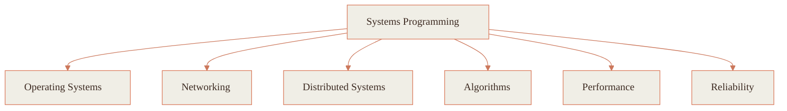

THOUGHTFUL CODE, BUILT WITH CARE

 

  

 

哈尔滨工业大学（深圳）· 计算机在读。

我喜欢把东西做得清楚、克制，带一点好奇—— 
常在系统底层，用 <b>Rust</b>、<b>Go</b>、<b>C++</b>， 
追问一个系统，为什么是现在这样。

比起让它跑起来，我更想真正读懂它。 
好代码，多半是想清楚的事，被写得明白。 
而这意味着什么，我还在慢慢学。

 

· &nbsp; · &nbsp; ·

 

<b>THE TOOLS I REACH FOR</b>

<h3 align="center">技术栈</h3>

  

  

  

 

· &nbsp; · &nbsp; ·

 

<b>WHAT I'VE BEEN BUILDING</b>

<h3 align="center">活跃度</h3>

<picture>
  <source media="(prefers-color-scheme: dark)" srcset="https://raw.githubusercontent.com/Meredithelin/Meredithelin/output/github-contribution-grid-snake-dark.svg">
  <source media="(prefers-color-scheme: light)" srcset="https://raw.githubusercontent.com/Meredithelin/Meredithelin/output/github-contribution-grid-snake.svg">
  
</picture>

  

&nbsp;

  

  

 

· &nbsp; · &nbsp; ·

 

<b>HOW I THINK ABOUT SYSTEMS</b>

<h3 align="center">系统之思</h3>

 

· &nbsp; · &nbsp; ·

 

<b>SAY HELLO</b>

<h3 align="center">联系我</h3>

&nbsp;&nbsp;

&nbsp;&nbsp;

&nbsp;&nbsp;

 

<i>谢谢你看到这里。愿你安好，也做点温柔的东西。</i> 🧡

  

